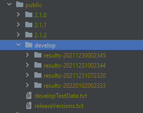

### Performance Chart App

We created an app to display metrics in charts that is available in `performanceMetrics` folder and can be run with `npm run serve`. 
This way we can view the performance of each individual components at a given date on released version or development branch.

Steps to run chart app:

```
cd performanceMetrics
npm install
npm run serve
```

A new page is loaded on :8080 port. A specific component can be selected from the `Component` dropdown and six charts are displayed for each performance metric (FPS, FID, CLS, DCL, FCP, LCP).


NOTE: This app is meant to be run on a dedicated server where all the performance tests results are saved. In order to have meaningful data on the local machine to test this app, please add the tests results in the `public` folder as following:

1. Create a folder for each enact released version

2. Create a folder named `develop`

3. In the `develop` folder, add a folder for every test run

    

4. Each of the created folders (for a version or a date in the develop branch) would contain .txt files with the tests results data for each component

    

5. Add a file named developTestDate.txt. It will contain the names for each folder located in the `develop` folder

    

6. Create a file named releaseVersions.txt. It will contain all the released version folder names

    